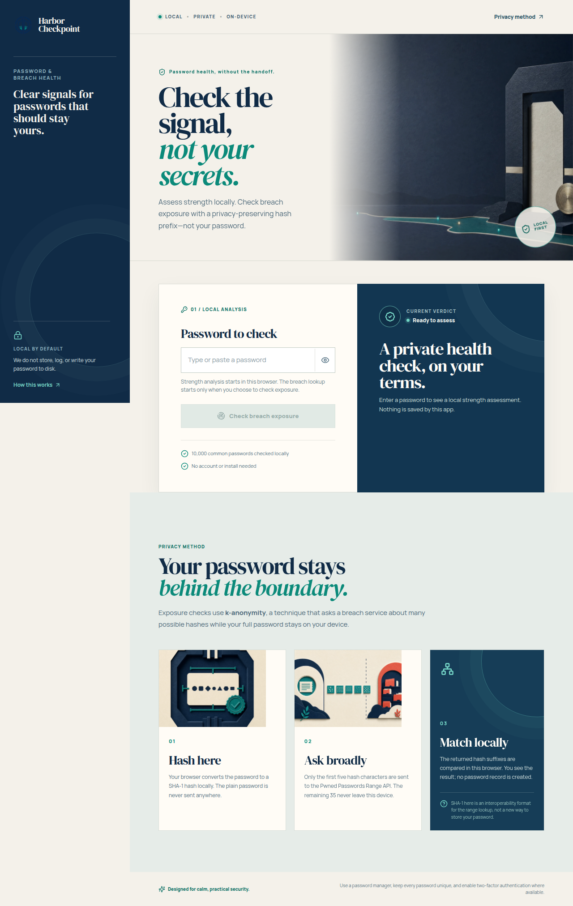
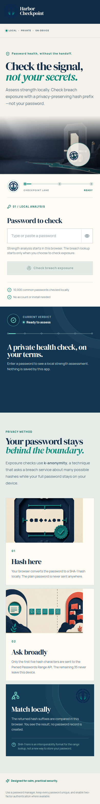

# Harbor Checkpoint — Password & Breach Health Checker

Harbor Checkpoint is a **privacy-first local web app** that helps people assess password strength and optional breach exposure without sending the password itself to a third party. Strength checks run in the browser using length, character diversity, predictable-pattern detection, and a bundled 10,000-entry common-password list. The optional breach lookup uses the Pwned Passwords Range API and k-anonymity.

> **Privacy promise:** the application does not store, log, cache, or write passwords to disk. For an exposure lookup, the password is hashed locally and only the first five characters of the SHA-1 hash are sent to the range service. The remaining hash suffix is compared locally in the browser.

## What it checks

| Area | Local behavior | Network behavior |
| --- | --- | --- |
| Password strength | Estimates entropy; checks length, character types, repeated characters, sequences, keyboard walks, and the bundled 10,000 common-password list. | None. |
| Breach exposure | Splits the locally created SHA-1 hash into a five-character prefix and a 35-character suffix. | Sends only the five-character prefix to the [Pwned Passwords Range API](https://api.pwnedpasswords.com/range/). |
| Result | Matches returned suffixes inside the browser and gives plain-language guidance. | The API never receives the password or the full SHA-1 hash. |

## Screenshots

### Desktop assessment lane



### Mobile privacy flow



## Run locally

This project uses Node.js 22+ and pnpm.

```bash
pnpm install
pnpm dev
```

Open the local address printed by Vite (usually `http://localhost:3000`). The app is a static frontend; no backend service, user account, or database is required.

## Test and build

```bash
pnpm test
pnpm run check
pnpm run build
```

The test suite covers strength classifications, empty/long/Unicode input, SHA-1 prefix/suffix splitting, mocked range responses, and the guarantee that the mock request receives only the five-character prefix.

## How k-anonymity protects the lookup

K-anonymity lets the app request a group of matching hash candidates rather than reveal a complete identifier. Harbor Checkpoint creates a SHA-1 hash of the entered password in browser memory, divides it into a **five-character prefix** and **35-character suffix**, requests the prefix’s candidate range, then compares the suffix locally. The full password and complete hash never cross the network boundary. The Pwned Passwords API supports this range-search design and can optionally pad its response; this app requests response padding with the `Add-Padding: true` header.[^1]

The use of SHA-1 in this narrow flow is for compatibility with the breach-range protocol; it is **not** a recommendation to store passwords with SHA-1. Use a password manager to generate and store unique passwords, and enable multi-factor authentication wherever it is available.

## Data source and attribution

The bundled common-password list is [`10k-most-common.txt`](https://github.com/danielmiessler/SecLists/blob/master/Passwords/Common-Credentials/10k-most-common.txt) from [SecLists](https://github.com/danielmiessler/SecLists). It is included strictly for local weak-password detection; no entered password is compared against a remote dictionary.

## Project structure

| Path | Purpose |
| --- | --- |
| `client/src/lib/passwordAnalysis.ts` | Local entropy, pattern, and bundled-wordlist strength analysis. |
| `client/src/lib/breachCheck.ts` | Browser-side SHA-1 hashing, range-prefix requests, and local suffix matching. |
| `client/src/pages/Home.tsx` | Harbor Checkpoint interface and in-memory interaction state. |
| `client/src/lib/*.test.ts` | Automated tests for scoring and k-anonymity behavior. |

## License

This project is released under the [MIT License](LICENSE).

[^1]: [Pwned Passwords — API documentation](https://haveibeenpwned.com/API/v3#PwnedPasswords)
